# Сайт https://dzen.ru/ защищен протоколом HTTPS
> Пример 1
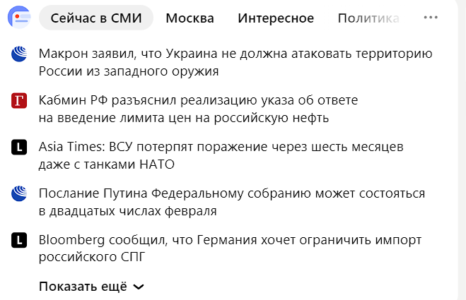
> Изминили первую новость
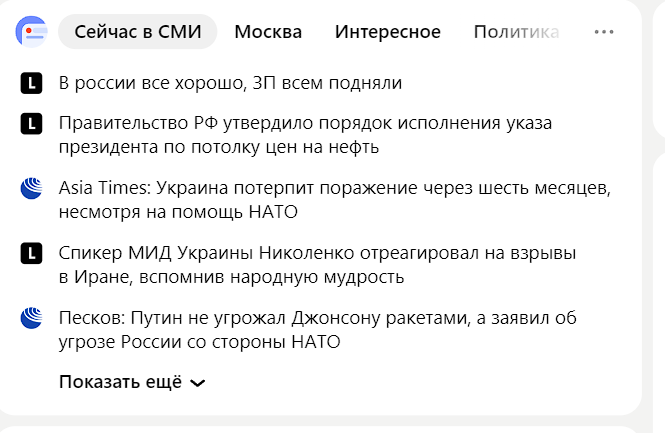

> Пример 2
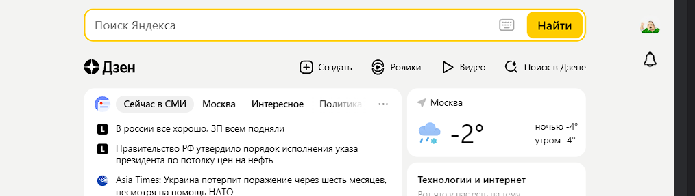
> Растянули поисковую строку
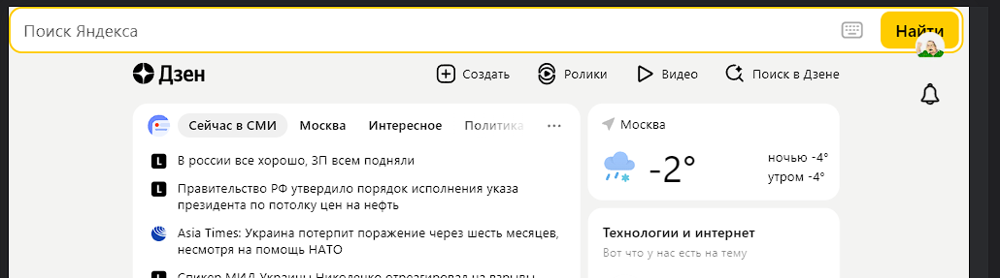

> Пример 3

>  Изминили названия навигационных кнопок
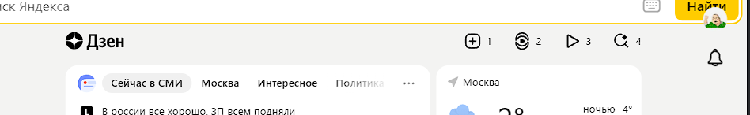

> Пример 4
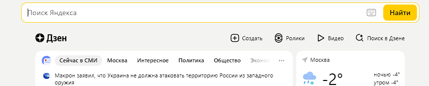
> Растянули логотип дзена
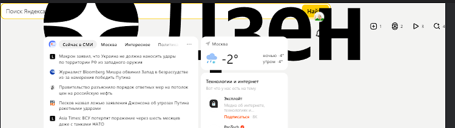

> Пример 5
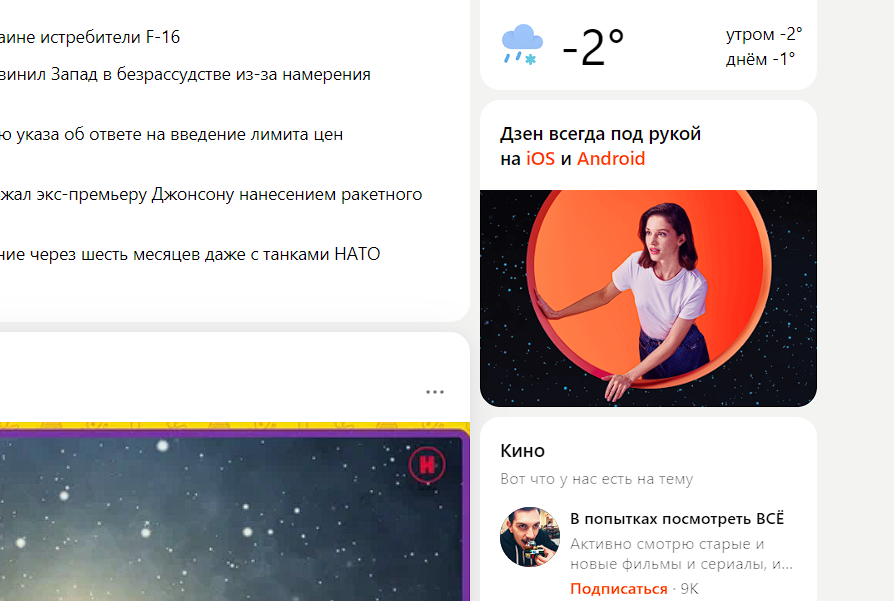
>Изминили картинку
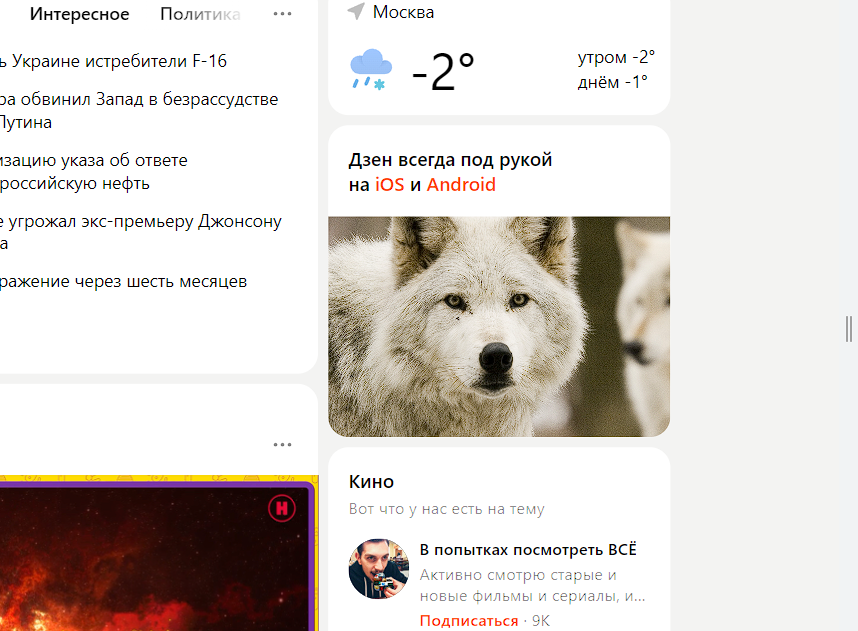

 > Пример 6
 
 > Изминили цвет кнопки подписки
 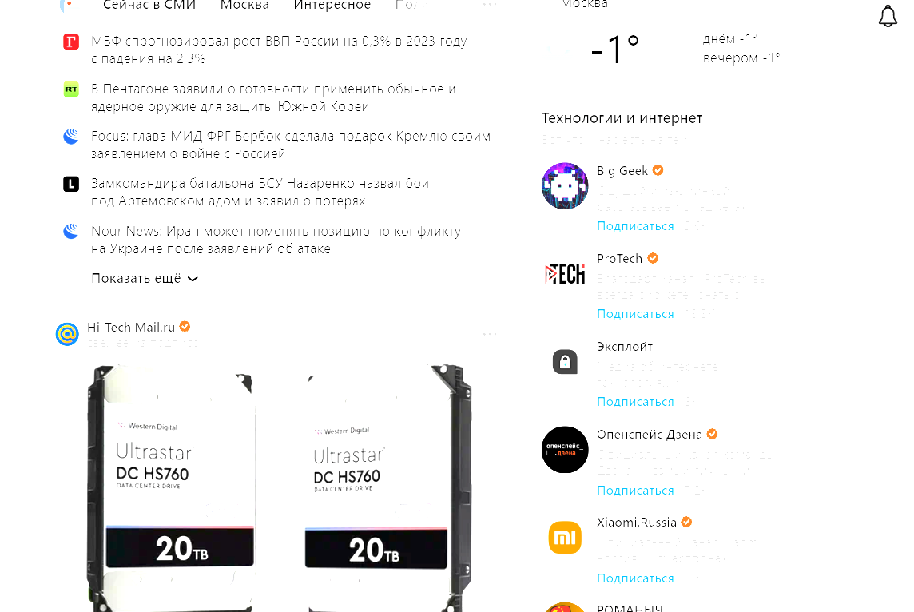

 > Пример 7
 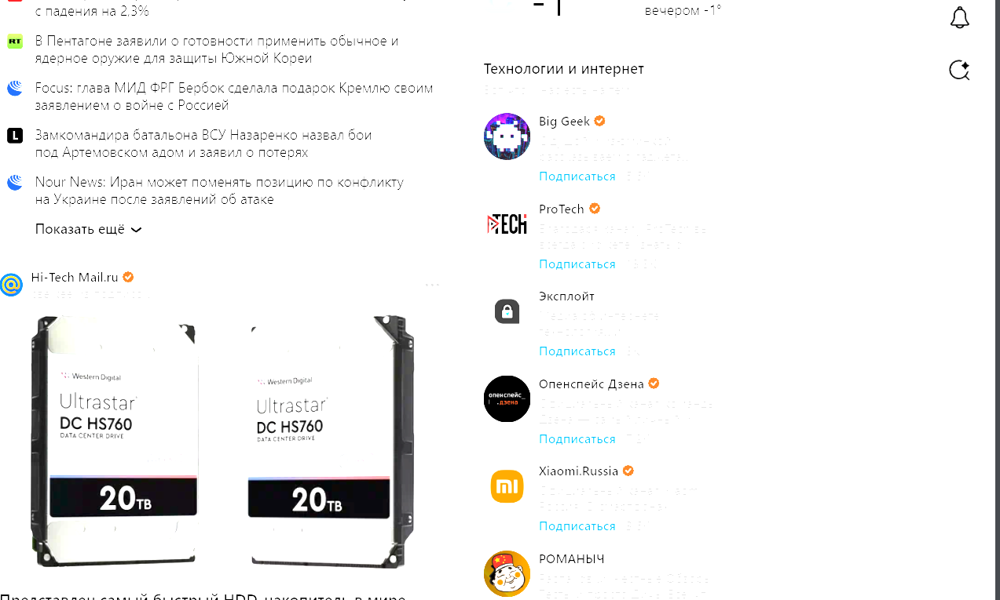
> Изминили цвет фона
 

 > Пример 8
 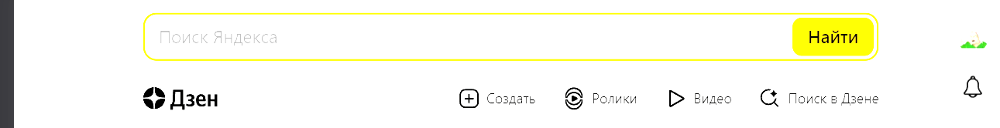
> Изминили контур окраса и цвет поля поиска
 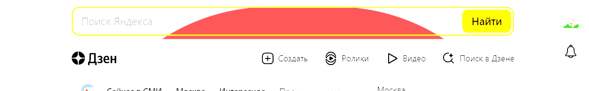